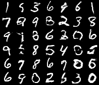
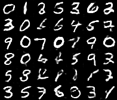
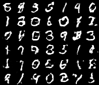
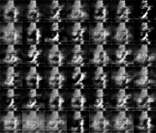

Wasserstein GANs in Tensorflow
==============================

This is my implementation of the Wasserstein GAN algorithm (see the [paper](https://arxiv.org/abs/1701.07875)) in Tensorflow/Keras, as well as my takeaways from playing with it.

## Training a model

To train a model, use the `run.py` script:

```
python run.py train \
  --dataset <dataset> \
  --model <epochs> \
  --n-batch <batch_size> \
  --lr <learning_rate> \
  --c <c_parameter> \
  --n-critic <critic_steps> \
  --log-dir <log_dir> \
  --epochs <training_epochs>
```

The model will report training/validation losses in the logfile.

### Configuration

The repository contains code for a standard DC-GAN, trained using the usual GAN loss, as well as a Wasserstein GAN that uses a similar architecture.

The model parameters are configures via command-line options:
* `--model` is either `dcgan` or `wdcgan` (standard or Wasserstein)
* `--dataset` is only `mnist` for now
* `--c` and `--n-critic` are the WGAN hyperparameters. The default values are the ones proposed in the paper.

Other flags are pretty self-explanatory.

## Observations

These are the results you get from a fully-trained DCGAN (left) or a WGAN (right):

:-------------------------:|:-------------------------:
  |  

The results are quite similar. However, I found the training process to be quite different.

### Training speed

The most obvious difference is that the GAN gives nice-looking numbers after less than 5 epochs (left), while the DCGAN takes nearly 100 epochs to get to the same level, and produces noise after the same 5 epochs (right):

:-------------------------:|:-------------------------:
  |  

Obviously, we only train the generator on one batch out of six by default (the other five batches are used to train the generator). However, the difference in training speed is much more than five-fold. The learning rate is also smaller for WGANs, but the same learning rate in DCGANs still gives much faster convergence. It seems like there is a deeper difference between the gradients that each method provides.

Several others have also reported that WGANs were relatively slow to train. Soumith Chintala suggested on Twitter to increase the learning rate of the generator; however this will probably help only in some cases.

### Stability

One of the central claims of the WGAN paper is that WGANs are much less sensitive to hyperparameter choices and to the model architecture. I am not yet convinced that it is completely true.

For example, if you add batch normalization in the first layer of the generator, the WGAN starts giving really bad results (even after hundreds of epochs; it's commented out in the code). However, having batch norm in the first layer of the standard DCGAN works perfectly fine. I haven't explored this thouroughly, but I'm a bit disappointed to see this kind of behavior on a dataset as simple as MNIST.

### Convergence metric

The other claim made in the paper is that the Earth Mover's distance (which is approximated by the discriminator/critic loss times minus one) provides a useful metric of convergence. Lower losses should correspond to higher-quality images.

That, I have found to be completely accurate. At first, the discriminator loss goes down, as the critic learns to tell apart the real examples from the fake ones. Then, the generator starts training and forces the discriminator's loss to steadily go up until convergence. 

In the above case (when I add a batch norm and the model doesn't train well), the Earth Mover's distance indeed gets stuck at a high plateau.

## Feedback

Send feedback to [Volodymyr Kuleshov](https://twitter.com/volkuleshov).